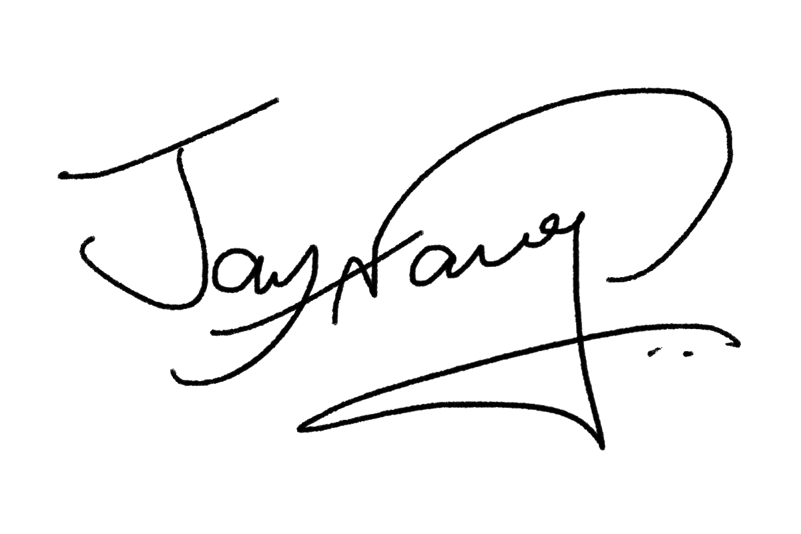

<link rel="stylesheet" href="../assets/styles.css">

Past and present

 

    

        

            
        

        
    

    

        
            Hello, I am Jay, and I was born in 1996. I graduated from National Cheng Kung University with a Master's degree in Artificial Intelligence in July 2021. My master's thesis is related to deep learning and natural language processing.
        
          
        
            I am proud of my self-learning ability. For example, I taught myself to write Android and iOS applications in my previous job; I studied computer science subjects on my own and passed my master's exam. I also learned Japanese and English in my spare time without spending any money.
        
          
        
            I am confident in my problem-solving and googling skills. For any task or program error, I can almost always find the solution independently. In addition, I constantly improve my ability to communicate and solve problems with other programmers.
        
          
        
            I am passionate about design and presentation. I like to design my websites, blogs, applications, and other works. I also enjoy making slides and sharing, teaching stuff to my classmates or colleagues. Because I love teaching, I created this blog and dedicated myself to creating content that either I or anyone would want to read again and again.
        
    

<!-- 
Future

    
        My dream is to work overseas as an artificial intelligence developer. At the same time, I really admired Shohei Ohtani, so I learned from him and built my future goals by using the Mandala Chart.
    

    

 -->

<!-- This website is powered by **[fastpages](https://github.com/fastai/fastpages)** [^1]. -->
<!-- [^1]:a blogging platform that natively supports Jupyter notebooks in addition to other formats. -->
